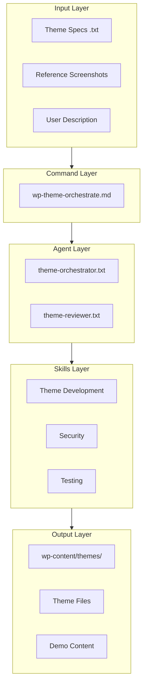
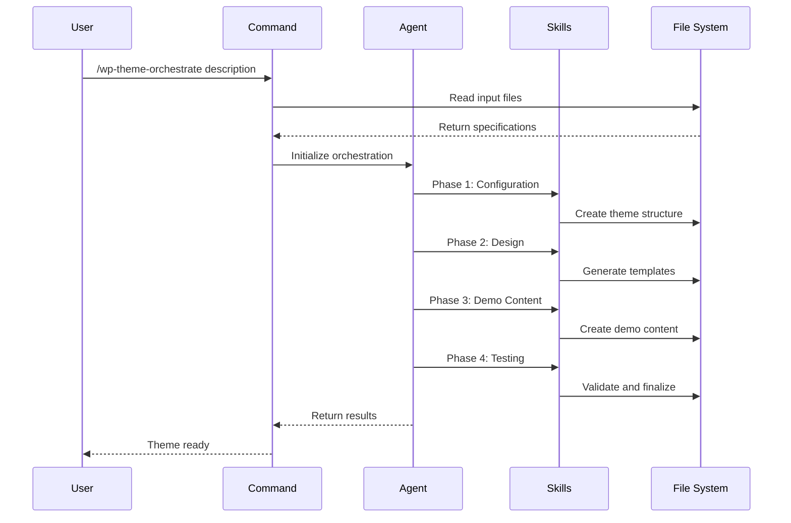

# WordPress Theme Orchestrator - Upgrade Plan

## Overview

This document outlines the comprehensive upgrade plan for the OpenCode WordPress project to enable full WordPress theme orchestration capabilities. The upgrade will create a new `/wp-theme-orchestrate` command that guides users through a 5-phase workflow (plus preliminary phase) for creating complete, functional WordPress themes, with optional WooCommerce integration for e-commerce themes.

## Current State Analysis

### Existing Components

The project currently includes:

- **8 Skills**: Theme development, plugin development, WooCommerce, security, REST API, testing, hooks/filters, database
- **4 Agents**: WordPress reviewer, build resolver, theme reviewer, plugin reviewer
- **5 Commands**: `/wp-theme`, `/wp-plugin`, `/wp-review`, `/wp-build-fix`, `/wc-build`
- **3 Hooks**: PHP lint, WP debug check, security check
- **Example Theme**: Located in `examples/theme-example/`

### Gap Analysis

| Feature | Current State | Required State |
|---------|--------------|----------------|
| Theme Creation | Single-phase review workflow | Multi-phase orchestration workflow |
| Input Handling | Command arguments only | File-based input with .txt and images |
| Design Reference | None | Screenshot analysis and design extraction |
| Demo Content | Manual creation | Automated demo content generation |
| Output Structure | User-defined | Structured `wp-content/themes/` output |

## Architecture Design

### System Components



### Workflow Phases

```mermaid
flowchart LR
    subgraph Phase0[Preliminary Phase]
        P0A[Request Project Description]
        P0B[Accept .txt Files]
        P0C[Accept Screenshots]
    end

    subgraph Phase1[Phase 1: Configuration]
        P1A[Theme Hierarchy Setup]
        P1B[Core Files Creation]
        P1C[CPT Definition]
    end

    subgraph Phase2[Phase 2: Design]
        P2A[Analyze Screenshots]
        P2B[Generate Templates]
        P2C[Implement Responsive]
    end

    subgraph Phase3[Phase 3: Demo Content]
        P3A[Create Homepage]
        P3B[Create Demo Page]
        P3C[Create Demo Post]
    end

    subgraph Phase4[Phase 4: Finalization]
        P4A[Code Integrity Check]
        P4B[Placeholder Removal]
        P4C[Functionality Testing]
    end

    subgraph Phase5[Phase 5: WooCommerce - Optional]
        P5A[WooCommerce Support Detection]
        P5B[Product Templates Generation]
        P5C[Shop Integration Testing]
    end

    Phase0 --> Phase1 --> Phase2 --> Phase3 --> Phase4
    Phase4 --> Phase5
```



## Implementation Plan

### Phase 1: Configuration and Structure

#### 1.1 New Command: `/wp-theme-orchestrate`

**File**: `.opencode/commands/wp-theme-orchestrate.md`

**Purpose**: Main orchestration command that coordinates the entire theme creation workflow.

**Features**:
- Accepts user description as primary argument
- Reads input files from `plans/input/` directory
- Coordinates 4-phase workflow execution
- Outputs to `wp-content/themes/{theme-name}/`

**Command Structure**:
```markdown
# WordPress Theme Orchestration Workflow

## Input Sources
- User description: $ARGUMENTS
- Theme specification: plans/input/theme-spec.txt
- Site configuration: plans/input/site-config.txt
- Reference screenshots: plans/input/screenshots/

## Workflow Phases
[Detailed phase instructions]
```

#### 1.2 New Agent: `theme-orchestrator`

**File**: `.opencode/prompts/agents/theme-orchestrator.txt`

**Purpose**: Specialized agent for orchestrating theme creation with full workflow management.

**Capabilities**:
- Read and parse input files
- Analyze screenshot images for design extraction
- Generate complete theme file structure
- Create demo content with realistic data
- Validate and test generated code

**Agent Configuration**:
```json
{
  "theme-orchestrator": {
    "description": "WordPress theme orchestration specialist. Creates complete themes from specifications and screenshots.",
    "mode": "subagent",
    "prompt": "{file:prompts/agents/theme-orchestrator.txt}",
    "tools": {
      "read": true,
      "write": true,
      "edit": true,
      "bash": true
    }
  }
}
```

#### 1.3 Input Directory Structure

**Directory**: `plans/input/`

```
plans/
├── input/
│   ├── theme-spec.txt          # Theme specifications
│   ├── site-config.txt          # Site configuration
│   ├── custom-post-types.txt    # CPT definitions
│   ├── color-scheme.txt         # Color palette
│   ├── typography.txt           # Typography settings
│   └── screenshots/
│       ├── homepage.png         # Homepage design
│       ├── page.png             # Page template design
│       ├── single-post.png      # Single post design
│       ├── archive.png          # Archive design
│       ├── product-list.png     # Product list design (if WooCommerce)
│       ├── single-product.png   # Single product design (if WooCommerce)
│       └── custom-post.png      # Custom post type design
```

### Phase 2: Design and Layout Development

#### 2.1 Screenshot Analysis Integration

**Process**:
1. Read screenshot images from `plans/input/screenshots/`
2. Extract design elements:
   - Color palette
   - Typography choices
   - Layout structure
   - Component patterns
   - Responsive breakpoints
3. Generate CSS custom properties
4. Create template HTML structure

**Design Extraction Output**:
```css
:root {
  /* Extracted from homepage.png */
  --color-primary: #0073aa;
  --color-secondary: #23282d;
  --color-accent: #00a0d2;
  --font-heading: 'Inter', sans-serif;
  --font-body: 'Open Sans', sans-serif;
  --spacing-unit: 8px;
  /* ... */
}
```

#### 2.2 Template Generation

**Templates to Generate**:
- `header.php` - Site header with navigation
- `footer.php` - Site footer with widgets
- `index.php` - Main template fallback
- `front-page.php` - Homepage template
- `home.php` - Blog posts index
- `single.php` - Single post template
- `page.php` - Default page template
- `archive.php` - Archive template
- `search.php` - Search results
- `404.php` - Error page
- `sidebar.php` - Sidebar template
- `template-parts/` - Reusable components

#### 2.3 Responsive Design Implementation

**Breakpoints**:
```css
/* Mobile First Approach */
/* Base: 0-576px (mobile) */
/* sm: 576px (large mobile) */
/* md: 768px (tablet) */
/* lg: 992px (desktop) */
/* xl: 1200px (large desktop) */
/* xxl: 1400px (extra large) */
```

### Phase 3: Demo Content Implementation

#### 3.1 Homepage Creation

**Content**:
- Hero section with CTA
- Featured content grid
- Latest posts section
- Testimonials (optional)
- Contact information

**Implementation**:
- Create page programmatically
- Set as front page
- Add featured image
- Configure page template

#### 3.2 Demo Page Creation

**Content**:
- Sample page with various blocks
- Image gallery
- Contact form placeholder
- Sidebar demonstration

#### 3.3 Demo Post Creation

**Content**:
- Sample blog post with:
  - Featured image
  - Categories and tags
  - Comments enabled
  - Author information

### Phase 4: Finalization and Testing

#### 4.1 Code Integrity Checks

- PHP syntax validation
- WordPress coding standards
- Security audit
- Performance review

#### 4.2 Placeholder Removal

- Replace all `TODO` comments
- Remove placeholder text
- Replace dummy images with proper references
- Clean up debug code

#### 4.3 Functionality Testing

- Theme activation test
- Template hierarchy verification
- Customizer options test
- Widget areas test
- Navigation menus test
- Responsive design test

### Phase 5: WooCommerce Integration (Optional)

This phase is executed only when WooCommerce support is requested in the theme specifications.

#### 5.1 WooCommerce Support Detection

**Trigger Conditions**:
- `theme-spec.txt` includes `WooCommerce Support: yes`
- Screenshots include product-related designs (`product-list.png`, `single-product.png`)
- User description mentions e-commerce, shop, or products

**Support Declaration**:
```php
// In functions.php
function theme_add_woocommerce_support() {
    add_theme_support( 'woocommerce' );
    add_theme_support( 'wc-product-gallery-zoom' );
    add_theme_support( 'wc-product-gallery-lightbox' );
    add_theme_support( 'wc-product-gallery-slider' );
}
add_action( 'after_setup_theme', 'theme_add_woocommerce_support' );
```

#### 5.2 WooCommerce Template Generation

**Templates to Generate**:
- `woocommerce/` - WooCommerce template overrides directory
- `woocommerce/archive-product.php` - Shop/archive product template
- `woocommerce/single-product.php` - Single product template
- `woocommerce/content-product.php` - Product loop item
- `woocommerce/content-single-product.php` - Single product content
- `woocommerce/product-searchform.php` - Product search form
- `woocommerce/cart/` - Cart templates
- `woocommerce/checkout/` - Checkout templates
- `woocommerce/myaccount/` - Account templates

**WooCommerce CSS Integration**:
```css
/* WooCommerce Styles */
.woocommerce-page .content-area {
    max-width: var(--content-width);
}

.woocommerce ul.products li.product {
    /* Product grid styling based on screenshots */
}

.woocommerce div.product .woocommerce-tabs {
    /* Single product tabs styling */
}

/* Responsive WooCommerce */
@media (max-width: 768px) {
    .woocommerce ul.products li.product {
        width: 100%;
    }
}
```

#### 5.3 WooCommerce Demo Content

**Demo Products**:
- Create sample product categories
- Create 3-5 demo products with:
  - Product images
  - Prices
  - Descriptions
  - Categories and tags
  - Variable product (if applicable)

**Shop Page Configuration**:
- Set WooCommerce shop page
- Configure product display settings
- Set product columns and rows

#### 5.4 WooCommerce Integration Testing

**Tests**:
- Shop page renders correctly
- Single product page displays properly
- Product gallery functions
- Cart and checkout flow
- Account pages
- Responsive product grid
- WooCommerce widgets

## File Structure

### New Files to Create

```
.opencode/
├── commands/
│   └── wp-theme-orchestrate.md     # NEW: Main orchestration command
├── prompts/
│   └── agents/
│       └── theme-orchestrator.txt  # NEW: Orchestrator agent prompt
└── opencode.json                   # MODIFY: Add new command/agent

plans/
├── input/                          # NEW: Input directory
│   ├── .gitkeep
│   ├── README.md                   # Input files documentation
│   └── screenshots/                # NEW: Screenshots directory
│       └── .gitkeep
├── input-templates/                # NEW: Template files
│   ├── theme-spec.template.txt
│   ├── site-config.template.txt
│   ├── custom-post-types.template.txt
│   └── color-scheme.template.txt
└── wordpress-theme-orchestrator-upgrade.md  # This plan

skills/
└── wordpress-theme-development/
    └── SKILL.md                    # MODIFY: Add orchestration patterns

wp-content/                         # NEW: Output directory
└── themes/
    └── .gitkeep
```

### Files to Modify

1. **`.opencode/opencode.json`**
   - Add `theme-orchestrator` agent
   - Add `wp-theme-orchestrate` command

2. **`skills/wordpress-theme-development/SKILL.md`**
   - Add orchestration workflow section
   - Add screenshot analysis patterns
   - Add demo content generation patterns

## Command Specification

### `/wp-theme-orchestrate` Command

**Usage**:
```bash
/wp-theme-orchestrate "Create a modern business theme with dark mode support"
```

**Arguments**:
- `$ARGUMENTS`: User description of the theme

**Input Files** (optional):
- `plans/input/theme-spec.txt`: Detailed theme specifications
- `plans/input/site-config.txt`: Site configuration
- `plans/input/screenshots/`: Reference design images

**Output**:
- Complete theme in `wp-content/themes/{theme-name}/`
- Installation instructions
- Theme documentation

### Command Workflow



## Agent Prompt Structure

### `theme-orchestrator.txt`

```markdown
# WordPress Theme Orchestrator Agent

You are a specialized WordPress theme orchestrator responsible for creating complete, production-ready themes.

## Capabilities

1. **Input Processing**
   - Parse theme specifications from .txt files
   - Analyze screenshot images for design extraction
   - Interpret user descriptions

2. **Theme Generation**
   - Create complete theme file structure
   - Generate all required templates
   - Implement responsive design
   - Add Customizer options

3. **Demo Content**
   - Create sample pages
   - Create sample posts
   - Configure homepage

4. **Quality Assurance**
   - Validate code integrity
   - Remove placeholders
   - Test functionality

## Workflow

### Phase 0: Preliminary
[Detailed instructions]

### Phase 1: Configuration
[Detailed instructions]

### Phase 2: Design
[Detailed instructions]

### Phase 3: Demo Content
[Detailed instructions]

### Phase 4: Finalization
[Detailed instructions]

### Phase 5: WooCommerce (Optional)
[Detailed instructions - executed only if WooCommerce support is requested]

## Output Requirements

- All files in wp-content/themes/{theme-name}/
- No placeholder content
- Full responsive design
- Complete documentation
```

## Input Templates

### theme-spec.template.txt

```txt
# Theme Specification

## Basic Information
Theme Name: 
Theme URI: 
Author: 
Author URI: 
Description: 
Version: 1.0.0
Requires PHP: 8.0
Text Domain: 

## Features
- [ ] Custom Logo
- [ ] Custom Header
- [ ] Custom Background
- [ ] Post Thumbnails
- [ ] Custom Menus
- [ ] Widget Areas
- [ ] WooCommerce Support
- [ ] Dark Mode

## Color Scheme
Primary: 
Secondary: 
Accent: 
Background: 
Text: 

## Typography
Heading Font: 
Body Font: 
Base Font Size: 
Line Height: 

## Layout
Content Width: 
Sidebar Position: left|right|none
Header Style: standard|centered|minimal
Footer Columns: 1|2|3|4

## Custom Post Types
[Define any custom post types needed]

## Additional Requirements
[Any specific requirements]
```

### site-config.template.txt

```txt
# Site Configuration

## Site Information
Site Title: 
Tagline: 
Site URL: 

## Homepage Settings
Show on front: posts|page
Front page template: default|custom

## Blog Settings
Posts per page: 
Excerpt length: 
Featured image size: 

## Navigation
Primary Menu Items:
- Home
- About
- Services
- Blog
- Contact

Footer Menu Items:
- Privacy Policy
- Terms of Service
- Contact

## Widget Areas
- Primary Sidebar
- Footer 1
- Footer 2
- Footer 3

## Social Links
Facebook: 
Twitter: 
Instagram: 
LinkedIn: 
```

## Testing Strategy

### Unit Testing

- Test each generated file for syntax errors
- Validate theme against WordPress standards
- Check for security vulnerabilities

### Integration Testing

- Theme activation test
- Customizer functionality
- Widget areas
- Navigation menus
- Responsive breakpoints

### Visual Testing

- Compare generated design with screenshots
- Verify responsive behavior
- Check accessibility compliance

## Success Criteria

1. **Functionality**
   - Theme activates without errors
   - All templates render correctly
   - Customizer options work
   - Widgets function properly

2. **Quality**
   - No placeholder content
   - No debug code
   - Follows WordPress coding standards
   - Passes theme check

3. **Design**
   - Matches reference screenshots
   - Fully responsive
   - Accessible (WCAG 2.1 AA)
   - Performance optimized

4. **Documentation**
   - README with installation instructions
   - Changelog
   - Screenshot.png included

## Timeline

| Phase | Tasks | Status |
|-------|-------|--------|
| Planning | Architecture design, documentation | ✅ Complete |
| Phase 1 | Command, agent, input structure | ⏳ Pending |
| Phase 2 | Template generation, design extraction | ⏳ Pending |
| Phase 3 | Demo content, homepage creation | ⏳ Pending |
| Phase 4 | Testing, validation, documentation | ⏳ Pending |
| Phase 5 | WooCommerce integration (optional) | ⏳ Pending |

## Next Steps

1. Create `.opencode/commands/wp-theme-orchestrate.md`
2. Create `.opencode/prompts/agents/theme-orchestrator.txt`
3. Create `plans/input/` directory structure
4. Create input templates
5. Update `.opencode/opencode.json`
6. Enhance `skills/wordpress-theme-development/SKILL.md`
7. Create `wp-content/themes/` output directory
8. Test complete workflow

## Appendix

### A. File Checklist

#### Required Theme Files
- [ ] `style.css` (with theme metadata)
- [ ] `index.php` (required fallback)
- [ ] `functions.php`
- [ ] `screenshot.png` (1200x900)

#### Recommended Files
- [ ] `header.php`
- [ ] `footer.php`
- [ ] `sidebar.php`
- [ ] `single.php`
- [ ] `page.php`
- [ ] `archive.php`
- [ ] `front-page.php`
- [ ] `home.php`
- [ ] `search.php`
- [ ] `404.php`
- [ ] `comments.php`
- [ ] `README.md`

#### Asset Files
- [ ] `assets/css/style.css`
- [ ] `assets/css/responsive.css`
- [ ] `assets/js/main.js`
- [ ] `assets/images/`

#### Include Files
- [ ] `inc/setup.php`
- [ ] `inc/customizer.php`
- [ ] `inc/widgets.php`
- [ ] `inc/template-tags.php`
- [ ] `inc/template-functions.php`

### B. WordPress Theme Requirements

1. **Required Features**
   - `title-tag` support
   - `post-thumbnails` support
   - `html5` support
   - Proper content width
   - Translation ready

2. **Coding Standards**
   - WordPress Coding Standards (WPCS)
   - Proper escaping (`esc_html`, `esc_attr`, `esc_url`)
   - Input sanitization
   - Nonce verification for forms

3. **Accessibility**
   - Skip to content link
   - Proper heading hierarchy
   - ARIA labels
   - Keyboard navigation
   - Color contrast (4.5:1 minimum)

### C. References

- [WordPress Theme Developer Handbook](https://developer.wordpress.org/themes/)
- [Theme Review Guidelines](https://make.wordpress.org/themes/handbook/review/)
- [WordPress Coding Standards](https://developer.wordpress.org/coding-standards/wordpress-coding-standards/)
- [Theme Check Plugin](https://wordpress.org/plugins/theme-check/)